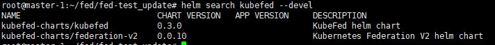
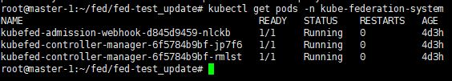

# Federation 설치 가이드

## 구성 요소 및 버전

## Prerequisites
* helm version 2

## 폐쇄망 설치 가이드
추후 작업 예정.

## Install Steps
0. [Binary 설치](https://github.com/tmax-cloud/hypercloud-install-guide/tree/master/Fed#step-0-binary-%EC%84%A4%EC%B9%98)
1. [helm을 통한 federation 설치](https://github.com/tmax-cloud/hypercloud-install-guide/tree/master/Fed#step-1-helm%EC%9D%84-%ED%86%B5%ED%95%9C-federation-%EC%84%A4%EC%B9%98)

## Step 0. Binary 설치
* 목적 : Fed 구축에 필요한 binary 설치
* 생성 순서 : 
    * 환경변수 설정
      ```bash
      $ export VERSION=0.1.0-rc5
      $ export OS=linux
      $ export ARCH=amd64
      ```
    * kubefedctl 설치
      ```bash
      $ curl -LO https://github.com/kubernetes-sigs/kubefed/releases/download/v${VERSION}/kubefedctl-${VERSION}-${OS}-${ARCH}.tgz
      $ tar -zxvf kubefedctl-*.tgz
      $ chmod u+x kubefedctl
      $ sudo mv kubefedctl /usr/local/bin/
      ```

## Step 1. helm을 통한 federation 설치
* 목적 : federation 구축
* 생성 순서 : 
    * KubeFed 차트 저장소를 로컬 저장소에 추가
      ```bash
      $ helm repo add kubefed-charts https://raw.githubusercontent.com/kubernetes-sigs/kubefed/master/charts
      $ helm repo list
      ```
      
    * 지정된 버전으로 kubefed chart 설치
      ```bash
      $ helm search kubefed --devel
      ```
      
      ```bash
      $ helm install kubefed-charts/kubefed --name kubefed --version=<x.x.x> --namespace kube-federation-system --devel
      ```
    * 정상 동작 확인
      ```bash
      $ kubectl get pod -n kube-federation-system
      
