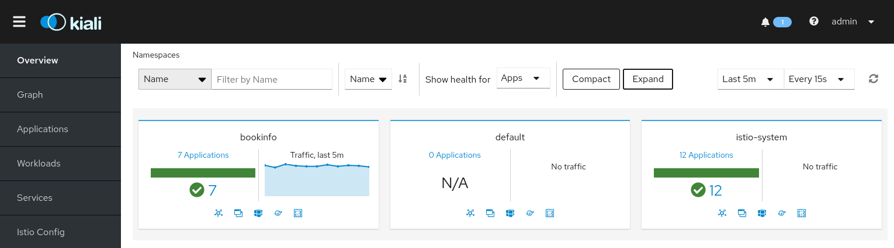
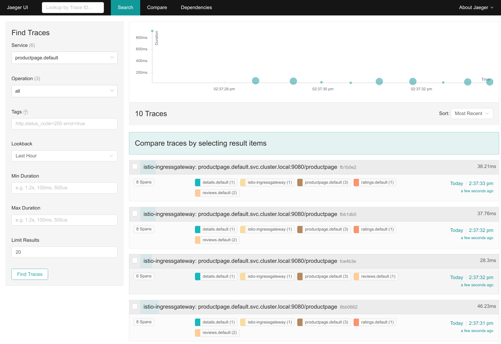
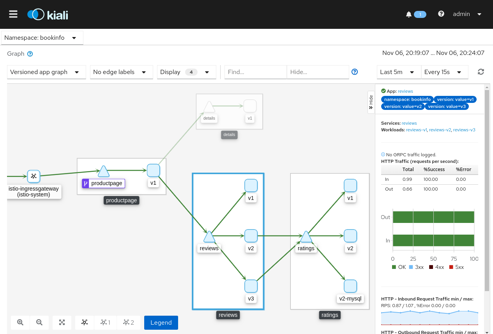

# Istio 설치 가이드

## 구성 요소 및 버전
* istiod ([docker.io/istio/pilot:1.5.1](https://hub.docker.com/layers/istio/pilot/1.5.1/images/sha256-818aecc1c73c53af9091ac1d4f500d9d7cec6d135d372d03cffab1addaff4ec0?context=explore))
* istio-ingressgateway ([docker.io/istio/proxyv2:1.5.1](https://hub.docker.com/layers/istio/proxyv2/1.5.1/images/sha256-3ad9ee2b43b299e5e6d97aaea5ed47dbf3da9293733607d9b52f358313e852ae?context=explore))
* istio-tracing ([docker.io/jaegertracing/all-in-one:1.16](https://hub.docker.com/layers/jaegertracing/all-in-one/1.16/images/sha256-738442983b772a5d413c8a2c44a5563956adaff224e5b38f52a959124dafc119?context=explore))
* kiali ([quay.io/kiali/kiali:v1.21](https://quay.io/repository/kiali/kiali?tab=tags))
* bookinfo example
    * productpage([docker.io/istio/examples-bookinfo-productpage-v1:1.15.0](https://hub.docker.com/layers/istio/examples-bookinfo-productpage-v1/1.15.0/images/sha256-0a5eb4795952372251d51f72834bccb7ea01a67cb72fd9b58b757cca103b7524?context=explore))
    * details([docker.io/istio/examples-bookinfo-details-v1:1.15.0](https://hub.docker.com/layers/istio/examples-bookinfo-details-v1/1.15.0/images/sha256-fce0bcbff0bed09116dacffca15695cd345e0c3788c15b0114a05f654ddecc17?context=explore))
    * ratings([docker.io/istio/examples-bookinfo-ratings-v1:1.15.0](https://hub.docker.com/layers/istio/examples-bookinfo-ratings-v1/1.15.0/images/sha256-09b9d6958a13ad1a97377b7d5c2aa9e0372c008cdf5a44ce3e72fbd9660936cf?context=explore))
    * reviews-v1([docker.io/istio/examples-bookinfo-reviews-v1:1.15.0](https://hub.docker.com/layers/istio/examples-bookinfo-reviews-v1/1.15.0/images/sha256-40e8aba77c1b46f37e820a60aa6948485d39e6f55f1492fa1f17383efd95511c?context=explore))
    * reviews-v2([docker.io/istio/examples-bookinfo-reviews-v2:1.15.0](https://hub.docker.com/layers/istio/examples-bookinfo-reviews-v2/1.15.0/images/sha256-e86d247b7ac275eb681a7e9c869325762686ccf0b5cfb6bde100ff2c1f01ae2b?context=explore))
    * reviews-v3([docker.io/istio/examples-bookinfo-reviews-v3:1.15.0](https://hub.docker.com/layers/istio/examples-bookinfo-reviews-v3/1.15.0/images/sha256-e454cab754cf9234e8b41d7c5e30f53a4c125d7d9443cb3ef2b2eb1c4bd1ec14?context=explore))

## Prerequisites

## 폐쇄망 설치 가이드
설치를 진행하기 전 아래의 과정을 통해 필요한 이미지 및 yaml 파일을 준비한다.
1. **폐쇄망에서 설치하는 경우** 사용하는 image repository에 istio 설치 시 필요한 이미지를 push한다. 

    * 작업 디렉토리 생성 및 환경 설정
    ```bash
    $ mkdir -p ~/istio-install
    $ export ISTIO_HOME=~/istio-install
    $ export ISTIO_VERSION=1.5.1
    $ export JAEGER_VERSION=1.16
    $ export KIALI_VERSION=v1.21
    $ export REGISTRY=[IP:PORT]
    $ cd $ISTIO_HOME
    ```
    * 외부 네트워크 통신이 가능한 환경에서 필요한 이미지를 다운받는다.
    ```bash
    $ sudo docker pull istio/pilot:${ISTIO_VERSION}
    $ sudo docker save istio/pilot:${ISTIO_VERSION} > istio-pilot_${ISTIO_VERSION}.tar
    $ sudo docker pull istio/proxyv2:${ISTIO_VERSION}
    $ sudo docker save istio/proxyv2:${ISTIO_VERSION} > istio-proxyv2_${ISTIO_VERSION}.tar
    $ sudo docker pull jaegertracing/all-in-one:${JAEGER_VERSION}
    $ sudo docker save jaegertracing/all-in-one:${JAEGER_VERSION} > jaeger_${JAEGER_VERSION}.tar
    $ sudo docker pull quay.io/kiali/kiali:${KIALI_VERSION}
    $ sudo docker save quay.io/kiali/kiali:${KIALI_VERSION} > kiali_${KIALI_VERSION}.tar
    // bookinfo example images
    $ sudo docker pull istio/examples-bookinfo-productpage-v1:1.15.0
    $ sudo docker pull istio/examples-bookinfo-details-v1:1.15.0
    $ sudo docker pull istio/examples-bookinfo-ratings-v1:1.15.0
    $ sudo docker pull istio/examples-bookinfo-reviews-v1:1.15.0
    $ sudo docker pull istio/examples-bookinfo-reviews-v2:1.15.0
    $ sudo docker pull istio/examples-bookinfo-reviews-v3:1.15.0
    $ sudo docker save istio/examples-bookinfo-productpage-v1:1.15.0 > productpage.tar
    $ sudo docker save istio/examples-bookinfo-details-v1:1.15.0 > details.tar
    $ sudo docker save istio/examples-bookinfo-ratings-v1:1.15.0 > ratings.tar
    $ sudo docker save istio/examples-bookinfo-reviews-v1:1.15.0 > reviews-v1.tar
    $ sudo docker save istio/examples-bookinfo-reviews-v2:1.15.0 > reviews-v2.tar
    $ sudo docker save istio/examples-bookinfo-reviews-v3:1.15.0 > reviews-v3.tar
    ```
    * install yaml을 다운로드한다.
    ```bash
    $ wget https://raw.githubusercontent.com/tmax-cloud/hypercloud-install-guide/4.1/Istio/yaml/1.istio-base.yaml
    $ wget https://raw.githubusercontent.com/tmax-cloud/hypercloud-install-guide/4.1/Istio/yaml/2.kiali.yaml
    $ wget https://raw.githubusercontent.com/tmax-cloud/hypercloud-install-guide/4.1/Istio/yaml/3.istio-tracing.yaml
    $ wget https://raw.githubusercontent.com/tmax-cloud/hypercloud-install-guide/4.1/Istio/yaml/4.istio-core.yaml
    $ wget https://raw.githubusercontent.com/tmax-cloud/hypercloud-install-guide/4.1/Istio/yaml/5.istio-ingressgateway.yaml
    $ wget https://raw.githubusercontent.com/tmax-cloud/hypercloud-install-guide/4.1/Istio/yaml/6.istio-metric.yaml
    $ wget https://raw.githubusercontent.com/tmax-cloud/hypercloud-install-guide/4.1/Istio/yaml/bookinfo.yaml
    ```
  
2. 위의 과정에서 생성한 tar 파일들을 폐쇄망 환경으로 이동시킨 뒤 사용하려는 registry에 이미지를 push한다.
    ```bash
    $ sudo docker load < istio-pilot_${ISTIO_VERSION}.tar
    $ sudo docker load < istio-proxyv2_${ISTIO_VERSION}.tar
    $ sudo docker load < jaeger_${JAEGER_VERSION}.tar
    $ sudo docker load < kiali_${KIALI_VERSION}.tar
    $ sudo docker load < productpage.tar
    $ sudo docker load < details.tar
    $ sudo docker load < ratings.tar
    $ sudo docker load < reviews-v1.tar
    $ sudo docker load < reviews-v2.tar
    $ sudo docker load < reviews-v3.tar
    
    $ sudo docker tag istio/pilot:${ISTIO_VERSION} ${REGISTRY}/istio/pilot:${ISTIO_VERSION}
    $ sudo docker tag istio/proxyv2:${ISTIO_VERSION} ${REGISTRY}/istio/proxyv2:${ISTIO_VERSION}
    $ sudo docker tag jaegertracing/all-in-one:${JAEGER_VERSION} ${REGISTRY}/jaegertracing/all-in-one:${JAEGER_VERSION}
    $ sudo docker tag quay.io/kiali/kiali:${KIALI_VERSION} ${REGISTRY}/kiali/kiali:${KIALI_VERSION}
    $ sudo docker tag istio/examples-bookinfo-productpage-v1:1.15.0 ${REGISTRY}/istio/examples-bookinfo-productpage-v1:1.15.0
    $ sudo docker tag istio/examples-bookinfo-details-v1:1.15.0 ${REGISTRY}/istio/examples-bookinfo-details-v1:1.15.0
    $ sudo docker tag istio/examples-bookinfo-ratings-v1:1.15.0 ${REGISTRY}/istio/examples-bookinfo-ratings-v1:1.15.0
    $ sudo docker tag istio/examples-bookinfo-reviews-v1:1.15.0 ${REGISTRY}/istio/examples-bookinfo-reviews-v1:1.15.0
    $ sudo docker tag istio/examples-bookinfo-reviews-v2:1.15.0 ${REGISTRY}/istio/examples-bookinfo-reviews-v2:1.15.0
    $ sudo docker tag istio/examples-bookinfo-reviews-v3:1.15.0 ${REGISTRY}/istio/examples-bookinfo-reviews-v3:1.15.0
    
    $ sudo docker push ${REGISTRY}/istio/pilot:${ISTIO_VERSION}
    $ sudo docker push ${REGISTRY}/istio/proxyv2:${ISTIO_VERSION}
    $ sudo docker push ${REGISTRY}/jaegertracing/all-in-one:${JAEGER_VERSION}
    $ sudo docker push ${REGISTRY}/kiali/kiali:${KIALI_VERSION}
    $ sudo docker push ${REGISTRY}/istio/examples-bookinfo-productpage-v1:1.15.0
    $ sudo docker push ${REGISTRY}/istio/examples-bookinfo-details-v1:1.15.0
    $ sudo docker push ${REGISTRY}/istio/examples-bookinfo-ratings-v1:1.15.0
    $ sudo docker push ${REGISTRY}/istio/examples-bookinfo-reviews-v1:1.15.0
    $ sudo docker push ${REGISTRY}/istio/examples-bookinfo-reviews-v2:1.15.0
    $ sudo docker push ${REGISTRY}/istio/examples-bookinfo-reviews-v3:1.15.0
    ```


## Install Steps
0. [istio yaml 수정](https://github.com/tmax-cloud/hypercloud-install-guide/tree/master/Istio#step0-istio-yaml-%EC%88%98%EC%A0%95)
1. [istio namespace 및 customresourcedefinition 생성](https://github.com/tmax-cloud/hypercloud-install-guide/tree/master/Istio#step-1-istio-namespace-%EB%B0%8F-customresourcedefinition-%EC%83%9D%EC%84%B1)
2. [kiali 설치](https://github.com/tmax-cloud/hypercloud-install-guide/tree/master/Istio#step-2-kiali-%EC%84%A4%EC%B9%98)
3. [istio-tracing 설치](https://github.com/tmax-cloud/hypercloud-install-guide/tree/master/Istio#step-3-istio-tracing-%EC%84%A4%EC%B9%98)
4. [istiod 설치](https://github.com/tmax-cloud/hypercloud-install-guide/tree/master/Istio#step-4-istiod-%EC%84%A4%EC%B9%98)
5. [istio-ingressgateway 설치](https://github.com/tmax-cloud/hypercloud-install-guide/tree/master/Istio#step-5-istio-ingressgateway-%EC%84%A4%EC%B9%98)
6. [istio metric prometheus에 등록](https://github.com/tmax-cloud/hypercloud-install-guide/tree/master/Istio#step-6-istio-metric-prometheus%EC%97%90-%EB%93%B1%EB%A1%9D)
7. [bookinfo 예제](https://github.com/tmax-cloud/hypercloud-install-guide/tree/master/Istio#step-7-bookinfo-%EC%98%88%EC%A0%9C)


## Step0. istio yaml 수정
* 목적 : `istio yaml에 이미지 registry, 버전 정보를 수정`
* 생성 순서 : 
    * 아래의 command를 수정하여 사용하고자 하는 image 버전 정보를 수정한다.
	```bash
	$ sed -i 's/{kiali_version}/'${KIALI_VERSION}'/g' 2.kiali.yaml
	$ sed -i 's/{jaeger_version}/'${JAEGER_VERSION}'/g' 3.istio-tracing.yaml
	$ sed -i 's/{istio_version}/'${ISTIO_VERSION}'/g' 4.istio-core.yaml
	$ sed -i 's/{istio_version}/'${ISTIO_VERSION}'/g' 5.istio-ingressgateway.yaml
	```
    * 아래의 command로 hyperauth IP를 확인하고 수정하여 사용하고자 하는 hyperauth IP 정보를 수정한다.
        ```bash
        $ kubectl get svc -n hyperauth hyperauth
        ```
	
	```bash	
	$ sed -i 's/{hyperauth_IP}/'${HYPERAUTH_IP}'/g' 2.kiali.yaml	
	```    
* 비고 :
    * `폐쇄망에서 설치를 진행하여 별도의 image registry를 사용하는 경우 registry 정보를 추가로 설정해준다.`
	```bash
	$ sed -i 's/quay.io\/kiali\/kiali/'${REGISTRY}'\/kiali\/kiali/g' 2.kiali.yaml
	$ sed -i 's/docker.io\/jaegertracing\/all-in-one/'${REGISTRY}'\/jaegertracing\/all-in-one/g' 3.istio-tracing.yaml
	$ sed -i 's/docker.io\/istio/'${REGISTRY}'\/istio/g' 4.istio-core.yaml
	$ sed -i 's/docker.io\/istio\/proxyv2/'${REGISTRY}'\/istio\/proxyv2/g' 5.istio-ingressgateway.yaml
	$ sed -i 's/docker.io/'${REGISTRY}'/g' bookinfo.yaml
	```

## Step 1. istio namespace 및 customresourcedefinition 생성
* 목적 : `istio system namespace, clusterrole, clusterrolebinding, serviceaccount, customresourcedefinition 생성`
* 생성 순서 : [1.istio-base.yaml](yaml/1.istio-base.yaml) 실행 `ex) kubectl apply -f 1.istio-base.yaml`


## Step 2. kiali 설치
* 목적 : `istio ui kiali 설치`
* 생성 순서: 
    * [2.kiali.yaml](yaml/2.kiali.yaml) 실행 `ex) kubectl apply -f 1.istio-base.yaml`
        * openid login 을 위한 설정
            * hyperauth 에서 client 설정에서 hypercloud4 선택 후 
                * implicit flow enabled 를 on 으로 변경
                * Valid Redirect URIs 추가 `ex) *`
    * kilai pod가 running임을 확인한 뒤 http://$KIALI_URL/api/kiali 에 접속해 정상 동작을 확인한다.
    * hypercloud console 과 연동을 위해 https 서버가 필요하여 tls secret 생성 및 ingress를 생성해야한다.
        * tls sercet 생성 `ex) kubectl create secret tls kiali-https-secret --key tls.key --cert tls.crt -n istio-system`
            * key, crt 파일 생성은 console tls secret 생성 [참조](https://github.com/tmax-cloud/hypercloud-install-guide/tree/master/Console#step-2-secret-tls-%EC%83%9D%EC%84%B1)	
        * [kiali-ingress.yaml](ayml/kiali-ingress.yaml) 실행하여 ingress 생성 `ex) kubectl apply -f kiali-ingress.yaml`
* 비고 :
    * kiali에 접속하기 위한 서비스를 [원하는 타입](yaml/2.kiali.yaml#L346)으로 변경할 수 있다.
    * kiali에 접속하기 위한 방식을 [strategy](yaml/2.kiali.yaml#L184)를 configmap을 수정해 변경할 수 있다.    
    * hypercloud console 과 연동을 위해 kiali default web_root가 /kiali 에서 /api/kiali로 수정되었다.
    
    
	



## Step 3. istio-tracing 설치
* 목적 : `tracing component jaeger 설치`
* 생성 순서 : [3.istio-tracing.yaml](yaml/3.istio-tracing.yaml) 실행
* 비고 : 
    * jaeger ui에 접속하기 위한 서비스를 [원하는 타입](yaml/3.istio-tracing.yaml#L245)으로 변경할 수 있다.
    * istio-tracing pod가 running임을 확인한 뒤 http://$JAEGER_URL/api/jaeger/search 에 접속해 정상 동작을 확인한다.
    * hypercloud console 과 연동을 위해 jeager default QUERY_BASE_PATH를 수정하였다.
	



## Step 4. istiod 설치
* 목적 : `istio core component 설치(istiod deployment, sidecar configmap, mutatingwebhookconfiguration...)`
* 생성 순서 : [4.istio-core.yaml](yaml/4.istio-core.yaml) 실행
* 비고 : 
    * [istio라는 이름의 configmap](yaml/4.istio-core.yaml#L403)을 수정하여 설정을 변경할 수 있다. 관련 설정은 [istio mesh config](https://istio.io/docs/reference/config/istio.mesh.v1alpha1/#MeshConfig)를 참고한다.
        * access log format을 변경하고 싶은 경우 [mesh.accessLogFormat](yaml/4.istio-core.yaml#L468)을 원하는 format으로 변경한다.
        * tracing sampling rate을 변경하고 싶은 경우 [value.traceSampling](yaml/4.istio-core.yaml#L459)을 원하는 값으로 변경한다.


## Step 5. istio-ingressgateway 설치
* 목적 : `istio ingressgateway 설치`
* 생성 순서 : [5.istio-ingressgateway.yaml](yaml/5.istio-ingressgateway.yaml) 실행


## Step 6. istio metric prometheus에 등록
* 목적 : `istio metric을 수집하기 위한 podmonitor 생성`
* 생성 순서 : [6.istio-metric.yaml](yaml/6.istio-metric.yaml) 실행
* 비고 : 
    * http://$PROMETHEUS_URL/graph 에 접속해 'envoy_'로 시작하는 istio 관련 metric이 수집되었는지 확인한다.
    * 만약 istio 관련 metric이 수집되지 않을 경우, Prometheus의 권한설정 문제일 수 있다. [prometheus-clusterRole.yaml](../Prometheus/yaml/manifests/prometheus-clusterRole.yaml)을 적용하거나 Prometheus를 최신 버전으로 설치한다.


## Step 7. bookinfo 예제
* 목적 : `istio 설치 검증을 위한 bookinfo 예제`
* 생성 순서 : [bookinfo.yaml](yaml/bookinfo.yaml) 실행
* 비고 : 
    * bookinfo 예제 배포
        * application에 접속하기 위해 [service productpage의 타입](yaml/bookinfo.yaml#L278)을 NodePort/LoadBalancer로 변경한다.
        * bookinfo 예제를 배포할 namespace에 istio-injected=enabled label을 추가한 뒤, bookinfo 예제를 배포한다. 
        ```bash
        $ kubectl label namespace $YOUR_NAMESPACE istio-injection=enabled
        $ kubectl apply -f bookinfo.yaml -n $YOUR_NAMESPACE
        ```
    * http://$PRODUCTPAGE_URL/productpage 에 접속해 정상적으로 배포되었는지 확인한 뒤, kiali dashboard(http://$KIALI_URL/kiali)에 접속해 아래 그림과 같이 서비스간에 관계를 표현해주는 그래프가 나오는지 확인한다.
	



## 인증서 갱신 가이드

1. 인증서 갱신을 위한 스크립트 파일을 다운로드 하고 권한을 설정해준다.
    ```bash
    $ wget https://raw.githubusercontent.com/istio/tools/release-1.8/bin/root-transition.sh
    $ chmod +x root-transition.sh
    ```
2. 인증서 만료일을 확인한다.
    ```bash
    $ ./root-transition.sh check-root
    ```
3. 스크립트 파일을 이용하여 인증서를 갱신한다(10년 갱신).
    ```bash
    $ ./root-transition.sh root-transition
    ```