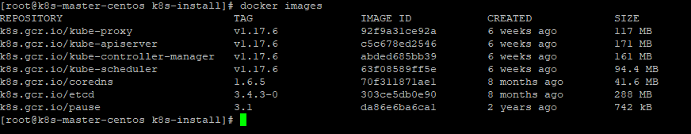
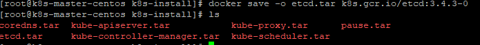
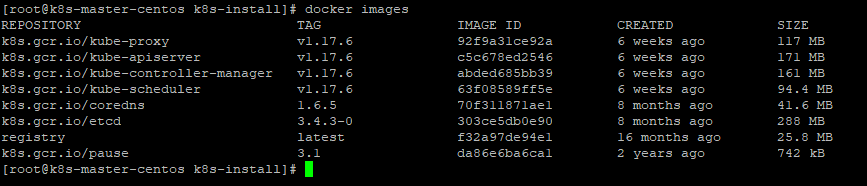
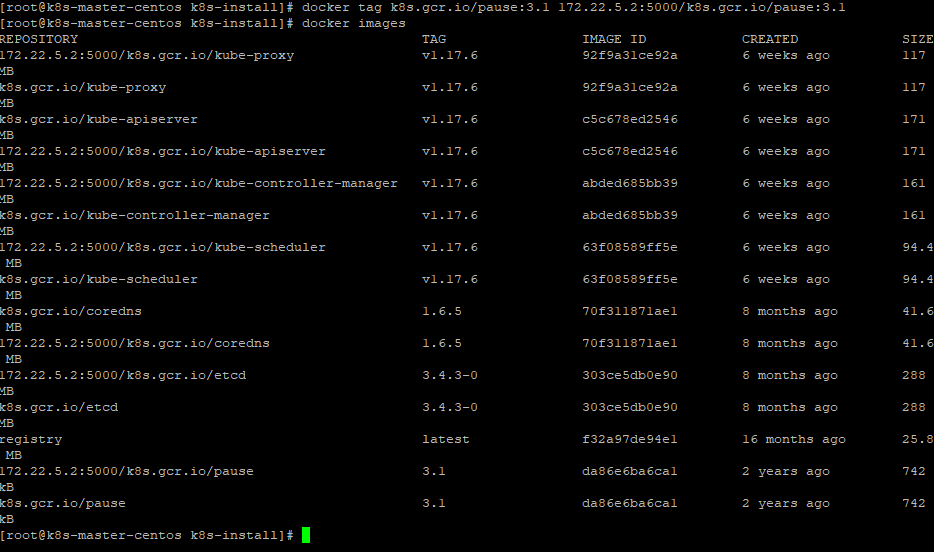
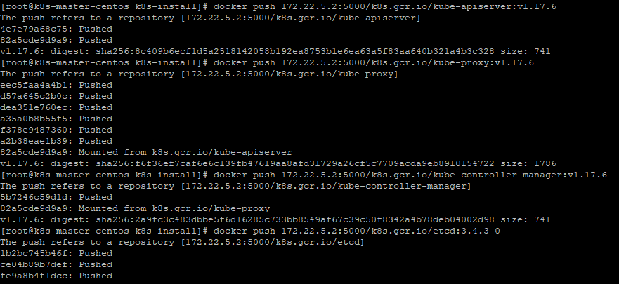
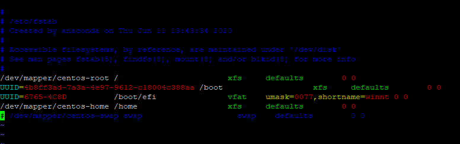
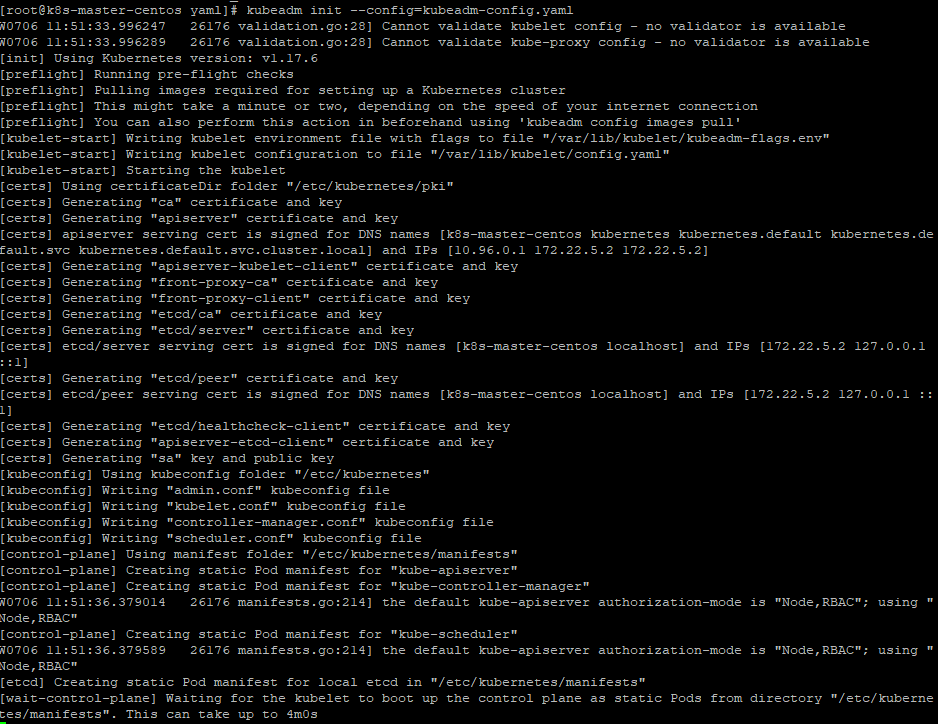
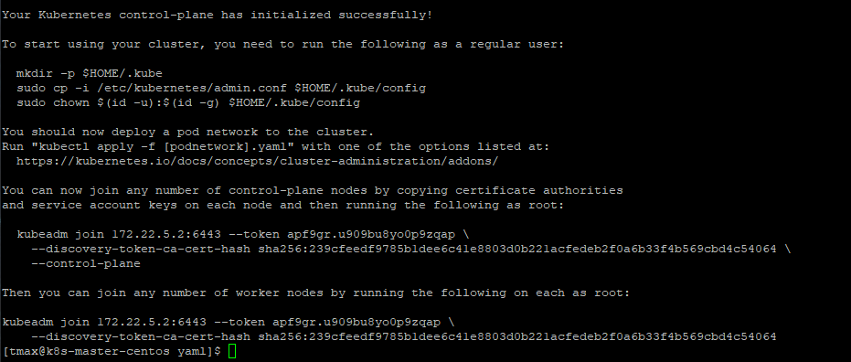
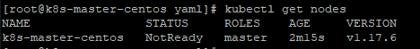
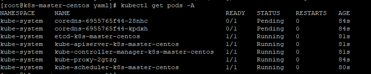

# k8s-master 설치 가이드

## 구성 요소 및 버전
* docker.io/k8s.gcr.io/kube-apiserver:v1.17.6
* docker.io/k8s.gcr.io/kube-proxy:v1.17.6
* docker.io/k8s.gcr.io/kube-scheduler:v1.17.6
* docker.io/k8s.gcr.io/kube-controller-manager:v1.17.6
* docker.io/k8s.gcr.io/etcd:3.4.3-0
* docker.io/k8s.gcr.io/pause:3.1
* docker.io/k8s.gcr.io/coredns:1.6.5

## Prerequisites

## 폐쇄망 설치 가이드
1. **폐쇄망에서 설치하는 경우** 아래 가이드를 참고 하여 image registry를 먼저 구축한다.
    * https://github.com/tmax-cloud/hypercloud-install-guide/tree/master/Image_Registry

2. 사용하는 image repository에 k8s 설치 시 필요한 이미지를 push한다. 
    * 작업 디렉토리 생성 및 환경 설정
    ```bash
    $ mkdir -p ~/k8s-install
    $ export K8S_HOME=~/k8s-install
    $ cd $K8S_HOME
    ```
    * 외부 네트워크 통신이 가능한 환경에서 필요한 이미지를 다운받는다.
    ```bash
    $ sudo docker pull k8s.gcr.io/kube-proxy:v1.17.6
    $ sudo docker pull k8s.gcr.io/kube-apiserver:v1.17.6
    $ sudo docker pull k8s.gcr.io/kube-controller-manager:v1.17.6
    $ sudo docker pull k8s.gcr.io/kube-scheduler:v1.17.6
    $ sudo docker pull k8s.gcr.io/etcd:3.4.3-0
    $ sudo docker pull k8s.gcr.io/coredns:1.6.5
    $ sudo docker pull k8s.gcr.io/pause:3.1
    ```
    
    * docker image를 tar로 저장한다.
    ```bash
    $ docker save -o kube-proxy.tar k8s.gcr.io/kube-proxy:v1.17.6
    $ docker save -o kube-controller-manager.tar k8s.gcr.io/kube-controller-manager:v1.17.6
    $ docker save -o etcd.tar k8s.gcr.io/etcd:3.4.3-0
    $ docker save -o coredns.tar k8s.gcr.io/coredns:1.6.5
    $ docker save -o kube-scheduler.tar k8s.gcr.io/kube-scheduler:v1.17.6
    $ docker save -o kube-apiserver.tar k8s.gcr.io/kube-apiserver:v1.17.6
    $ docker save -o pause.tar k8s.gcr.io/pause:3.1
    ```
    
3. 위의 과정에서 생성한 tar 파일들을 폐쇄망 환경으로 이동시킨 뒤 사용하려는 registry에 이미지를 push한다.
    ```bash
    $ sudo docker load -i kube-apiserver.tar
    $ sudo docker load -i kube-scheduler.tar
    $ sudo docker load -i kube-controller-manager.tar 
    $ sudo docker load -i kube-proxy.tar
    $ sudo docker load -i etcd.tar
    $ sudo docker load -i coredns.tar
    $ sudo docker load -i pause.tar
    ```
    
    ```bash
    $ docker tag k8s.gcr.io/kube-apiserver:v1.17.6 ${REGISTRY}/k8s.gcr.io/kube-apiserver:v1.17.6
    $ docker tag k8s.gcr.io/kube-proxy:v1.17.6 ${REGISTRY}/k8s.gcr.io/kube-proxy:v1.17.6
    $ docker tag k8s.gcr.io/kube-controller-manager:v1.17.6 ${REGISTRY}/k8s.gcr.io/kube-controller-manager:v1.17.6
    $ docker tag k8s.gcr.io/etcd:3.4.3-0 ${REGISTRY}/k8s.gcr.io/etcd:3.4.3-0
    $ docker tag k8s.gcr.io/coredns:1.6.5 ${REGISTRY}/k8s.gcr.io/coredns:1.6.5
    $ docker tag k8s.gcr.io/kube-scheduler:v1.17.6 ${REGISTRY}/k8s.gcr.io/kube-scheduler:v1.17.6
    $ docker tag k8s.gcr.io/pause:3.1 ${REGISTRY}/k8s.gcr.io/pause:3.1
    ```
    
    ```bash
    $ docker push ${REGISTRY}/k8s.gcr.io/kube-apiserver:v1.17.6
    $ docker push ${REGISTRY}/k8s.gcr.io/kube-proxy:v1.17.6
    $ docker push ${REGISTRY}/k8s.gcr.io/kube-controller-manager:v1.17.6
    $ docker push ${REGISTRY}/k8s.gcr.io/etcd:3.4.3-0
    $ docker push ${REGISTRY}/k8s.gcr.io/coredns:1.6.5
    $ docker push ${REGISTRY}/k8s.gcr.io/kube-scheduler:v1.17.6
    $ docker push ${REGISTRY}/k8s.gcr.io/pause:3.1
    ```
    
    
## Install Steps
0. [환경 설정](https://github.com/tmax-cloud/hypercloud-install-guide/tree/master/K8S_Master#step0)
1. [cri-o 설치](https://github.com/tmax-cloud/hypercloud-install-guide/tree/master/Istio#step-1-istio-namespace-%EB%B0%8F-customresourcedefinition-%EC%83%9D%EC%84%B1)
2. [kubeadm, kubelet, kubectl 설치](https://github.com/tmax-cloud/hypercloud-install-guide/tree/master/Istio#step-2-kiali-%EC%84%A4%EC%B9%98)
3. [kubernetes cluster 구성](https://github.com/tmax-cloud/hypercloud-install-guide/tree/master/Istio#step-3-istio-tracing-%EC%84%A4%EC%B9%98)


## Step0. 환경 설정
* 목적 : `k8s 설치 진행을 위한 os 환경 설정`
* 순서 : 
    * os hostname을 설정한다.
	```bash
	hostnamectl set-hostname k8s-master
	```
    * /etc/hosts에 hostname과 ip를 등록한다. 
	```bash
	127.0.0.1   localhost localhost.localdomain localhost4 localhost4.localdomain4
	::1         localhost localhost.localdomain localhost6 localhost6.localdomain6

	172.22.5.2 k8s-master
	```
    * 방화벽(firewall)을 해제한다. 
	```bash
	systemctl stop firewalld
	systemctl disable firewalld
	```	
    * 스왑 메모리를 비활성화 한다. 
	```bash
	swapoff -a
	```
    * 스왑 메모리 비활성화 영구설정
      * vi /etc/fstap 
	```bash
	swap 관련 부분 주석처리
	# /dev/mapper/centos-swap swap                    swap    defaults        0
	```
    
    * SELinux 설정을 해제한다. 
	```bash
	setenforce 0
	sed -i 's/^SELINUX=enforcing$/SELINUX=permissive/' /etc/selinux/config
	```

## Step 1. cri-o 설치
* 목적 : `k8s container runtime 설치`
* 순서 :
    * cri-o를 설치한다.
	```bash
	sudo yum -y install cri-o
	systemctl enable crio
	systemctl start crio
	```
    * cri-o 설치를 확인한다.
	```bash
	systemctl status crio
	rpm -qi cri-o
	```
    
* 비고 :
    * 추후 설치예정인 network plugin과 crio의 가상 인터페이스 충돌을 막기위해 cri-o의 default 인터페이스 설정을 제거한다.
	```bash
	rm -rf  /etc/cni/net.d/100-crio-bridge
 	rm -rf  /etc/cni/net.d/200-loopback
	``` 
    * 폐쇄망 환경에서 private registry 접근을 위해 crio.conf 내용을 수정한다.
    * insecure_registry, registries, plugin_dirs 내용을 수정한다.
      * vi /etc/crio/crio.conf
         * registries = ["{registry}:{port}" , "docker.io"]
         * insecure_registries = ["{registry}:{port}"]
         * plugin_dirs : "/opt/cni/bin" 추가
	 
    * crio 사용 전 환경 설정
	```bash
	modprobe overlay
	modprobe br_netfilter
	
	cat > /etc/sysctl.d/99-kubernetes-cri.conf <<EOF
	net.bridge.bridge-nf-call-iptables  = 1
	net.ipv4.ip_forward                 = 1
	net.bridge.bridge-nf-call-ip6tables = 1
	EOF
	```	
    * cri-o를 재시작 한다.
	```bash
	systemctl restart crio
	``` 	
## Step 2. kubeadm, kubelet, kubectl 설치
* 목적 : `Kubernetes 구성을 위한 kubeadm, kubelet, kubectl 설치한다.`
* 순서:
    * CRI-O 메이저와 마이너 버전은 쿠버네티스 메이저와 마이너 버전이 일치해야 한다.
    * kubeadm, kubectl, kubelet 설치 (v1.17.6)
	```bash
	yum install -y kubeadm-1.17.6-0 kubelet-1.17.6-0 kubectl-1.17.6-0
	```  	

## Step 3. kubernetes cluster 구성
* 목적 : `kubernetes master를 구축한다.`
* 순서 :
    * 쿠버네티스 설치시 필요한 kubeadm-config를 작성한다.
        * vi kubeadm-config.yaml
	```bash
	apiVersion: kubeadm.k8s.io/v1beta2
	kind: InitConfiguration
	localAPIEndpoint:
  		advertiseAddress: {master IP}
  		bindPort: 6443
	nodeRegistration:
  		criSocket: /var/run/crio/crio.sock
	---
	apiVersion: kubeadm.k8s.io/v1beta2
	kind: ClusterConfiguration
	kubernetesVersion: v1.17.6
	controlPlaneEndpoint: {master IP}:6443
	imageRepository: “{registry}/k8s.gcr.io”
	networking:
 		serviceSubnet: 10.96.0.0/16
  		podSubnet: "10.244.0.0/16"
	---
	apiVersion: kubelet.config.k8s.io/v1beta1
	kind: KubeletConfiguration
	cgroupDriver: systemd
	```
      * kubernetesVersion : kubernetes version
      * advertiseAddress : API server IP (master IP)
      * serviceSubnet : "${SERVICE_IP_POOL}/${CIDR}"
      * podSubnet : "${POD_IP_POOL}/${CIDR}"
      * imageRepository : "${registry} / docker hub name"
      * cgroupDriver: systemd cgroup driver 사용
	
    * kubeadm init
	```bash
	kubeadm init --config=kubeadm-config.yaml
	```
	
    * kubernetes config 
	```bash
	mkdir -p $HOME/.kube
	sudo cp -i /etc/kubernetes/admin.conf $HOME/.kube/config
	sudo chown $(id -u):$(id -g) $HOME/.kube/config
	```
	
    * 확인
	```bash
	kubectl get nodes
	```
	
	```bash
	kubectl get pods -A -o wide
	```
		
* 비고 : 
    * cri-o 매이저와 마이너 버전은 kubernetes 메이저와 마이너 버전이 일치해야 한다.
    * single node cluster 구성시 master taint를 제거한다
	```bash
	kubectl taint node [master hostname] node-role.kubernetes.io/master:NoSchedule-
	ex) kubectl taint node k8s- node-role.kubernetes.io/master:NoSchedule- 
	```    

## Step 3-1. kubernetes cluster 다중화 구성을 위한 Keepalived 설치
* 목적 : `K8S cluster의 Master 다중화 구성을 위한 Keepalived를 설치 및 설정한다`
* 순서 : 
    * Keepalived 설치
    ```bash
    yum install -y keepalived
    ```

    * Keepalived 설정
    ```bash
	vi /etc/keepalived/keepalived.conf
	
	vrrp_instance VI_1 {    
	state MASTER    
	interface enp0s8    
	virtual_router_id 50    
	priority 100    
	advert_int 1    
	nopreempt    
	authentication {        
		auth_type PASS        
		auth_pass $ place secure password here.   
		}   
	virtual_ipaddress {        
		VIP  
		} 
	}
    ```
	
	* interface : network interface 이름 확인
	* priority : Master 우선순위
	    * priority 값이 높으면 최우선적으로 Master 역할 수행
	    * 각 Master마다 다른 priority 값으로 수정.
	* virtual_ipaddress : VIP를 입력. Master IP 아님!
	
    * keepalived 재시작 및 상태 확인
    ```bash
    systemctl restart keepalived
    systemctl status keepalived
    ```
	
    * network interface 확인
    ```bash
    ip a
    ```
	
	* 설정한 VIP 확인 가능, 여러 마스터 중 하나만 보임.
	* inet {VIP}/32 scope global eno1

## Step 3-2. kubernetes cluster 다중화 구성 설정
* 목적 : `K8S cluster의 Master 다중화 구성을 위함`
* 순서 : 
    * kubeadm-config.yaml 파일로 kubeadm 명령어 실행.
        * Master 다중구성시 --upload-certs 옵션은 반드시 필요.
	    ```bash
	    kubeadm init --config=kubeadm-config.yaml --upload-certs
	    kubeadm join {IP}:{PORT} --token ~~ --control-plane --certificate-key ~~   (1)
	    kubeadm join {IP}:{PORT} --token ~~   (2)
	    ```
	* 해당 옵션은 certificates를 control-plane으로 upload하는 옵션
	* 해당 옵션을 설정하지 않을 경우, 모든 Master 노드에서 key를 복사해야 함
	* Master 단일구성과는 다르게, --control-plane --certificate-key 옵션이 추가된 명령어가 출력됨
	* (1)처럼 Master 다중구성을 위한 hash 값을 포함한 kubeadm join 명령어가 출력되므로 해당 명령어를 복사하여 다중구성에 포함시킬 다른 Master에서 실행
	* (2)처럼 Worker의 join을 위한 명령어도 출력되므로 Worker 노드 join시 사용
	
	* kubernetes config 
	    ```bash
	    mkdir -p $HOME/.kube
	    sudo cp -i /etc/kubernetes/admin.conf $HOME/.kube/config
	    sudo chown $(id -u):$(id -g) $HOME/.kube/config
	    ```
