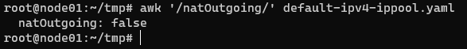

# NetworkAgent 설치 가이드

## 구성 요소 및 버전
* Hypernet-Local-Agent([tmaxcloudck/hypernet-local-agent:v0.4.2](https://hub.docker.com/repository/docker/tmaxcloudck/hypernet-local-agent))

### Upgrade
* [기존 Version에서 새로운 Version으로의 Upgrade는 이 링크를 참고해주세요.](https://github.com/tmax-cloud/hypercloud-install-guide/blob/master/NetworkAgent/UPGRADE.md)
## Prerequisites
1. Kubernetest ( 1.15.0 <= )
2. Calico ( 3.13.4 <= )
    * Agent가 동작하기 위해선 Calico CNI가 설치 되어 있어야합니다.
    * 현재 Calico 이외의 CNI는 지원하지 않습니다.
3. Calicoctl ( 3.15.0 <= )
4. Network Webhook (0.1.1 <= )
    * 시스템 Pod들이 Static IP Pool Resource로 부터 자동 할당받지 않기 위해서 필요한 Component입니다.
    * [설치 가이드](https://github.com/tmax-cloud/hypercloud-install-guide/blob/master/NetworkAgent/Network%20Webhook/README.md)

## 폐쇄망 설치 가이드
설치를 진행하기 전 아래의 과정을 통해 필요한 이미지 및 yaml 파일을 준비한다.
1. **폐쇄망에서 설치하는 경우** 사용하는 image repository에 Agent 설치 시 필요한 이미지를 push한다.     
    * 작업 디렉토리 생성 및 환경 설정(REGISTRY에는 각 환경에 맞는 IP:PORT 입력)
    ```bash
    $ export HYPERNET_LOCAL_AGENT_VERSION=0.4.2
	$ export REGISTRY=172.22.8.106:5000
    ```

    * 외부 네트워크 통신이 가능한 환경에서 필요한 이미지 및 yaml 파일을 다운받는다.
    ```bash
    $ sudo docker pull tmaxcloudck/hypernet-local-agent:${HYPERNET_LOCAL_AGENT_VERSION}
    $ sudo docker save tmaxcloudck/hypernet-local-agent:${HYPERNET_LOCAL_AGENT_VERSION} > hypernet-local-agent_${HYPERNET_LOCAL_AGENT_VERSION}.tar
	$ curl https://raw.githubusercontent.com/tmax-cloud/hypercloud-install-guide/master/NetworkAgent/public-ipv4-ippool.yaml > public-ipv4-ippool.yaml
	$ curl https://raw.githubusercontent.com/tmax-cloud/hypercloud-install-guide/master/NetworkAgent/floatingIp.yaml > floatingIp.yaml
	$ curl https://raw.githubusercontent.com/tmax-cloud/hypercloud-install-guide/master/NetworkAgent/hypernet-local-agent.yaml > hypernet-local-agent.yaml
    ```

2. 위의 과정에서 생성한 tar 파일들을 폐쇄망 환경으로 이동시킨 뒤 사용하려는 registry에 이미지를 push한다.
    ```bash
    $ sudo docker load < hypernet-local-agent_${HYPERNET_LOCAL_AGENT_VERSION}.tar
    $ sudo docker tag tmaxcloudck/hypernet-local-agent:${HYPERNET_LOCAL_AGENT_VERSION} ${REGISTRY}/tmaxcloudck/hypernet-local-agent:${HYPERNET_LOCAL_AGENT_VERSION}   
    $ sudo docker push ${REGISTRY}/tmaxcloudck/hypernet-local-agent:${HYPERNET_LOCAL_AGENT_VERSION}  
    ```
3. hypernet-local-agent.yaml의 Registry 정보 추가
	```bash
	$ sed -i 's/tmaxcloudck\/hypernet-local-agent/'${REGISTRY}'\/tmaxcloudck\/hypernet-local-agent/g' hypernet-local-agent.yaml
	```
	
## Install Steps
0. [Static IP 사용을 위한 IPPool 설정](#step0 "step0")
1. [Floating IP 사용을 위한 IPPool 설정](#step1 "step1")
2. [Hypernet-Local-Agent 설치](#step2 "step2")

<h2 id="step0">
Step 0. IPPool 설정(Static IP 전용. Static IP를 사용하지 않을 경우 Skip)
</h2>

* 목적 : `Static IP 사용을 위한 Public 대역 IP Pool 설정`
* 생성 순서 : 
    * Default IPPool 설정
	    * 아래의 commnad를 이용해 현재 설정된 default-ipv4-ippool 설정을 조회하고 변경
	    ```bash
		kubectl get ippool/default-ipv4-ippool -o yaml > tmp.yaml
		cat tmp.yaml | awk '/^apiVersion/' > default-ipv4-ippool.yaml && sed -i '/^apiVersion/d' tmp.yaml
		cat tmp.yaml | awk '/^kind/' >> default-ipv4-ippool.yaml && sed -i '/^kind/d' tmp.yaml
		cat tmp.yaml | awk '/^metadata/' >> default-ipv4-ippool.yaml && sed -i '/^metadata/d' tmp.yaml
		cat tmp.yaml | awk '/^\ \ name/' >> default-ipv4-ippool.yaml
		cat tmp.yaml | awk '/^spec/,EOF' >> default-ipv4-ippool.yaml
		sed -i 's/crd.projectcalico.org\/v1/projectcalico.org\/v3/' default-ipv4-ippool.yaml
	    ```
		* 아래의 command를 이용해 natOutgoing 값이 존재하는지 확인
		```bash
			awk '/natOutgoing/' default-ipv4-ippool.yaml
		```
		* Command의 결과로 아래와 같이 "natOutgoing: "을 포함한 문자열이 출력되는 경우 아래 Command 실행
		
		```bash
			sed -i '/natOutgoing/d' default-ipv4-ippool.yaml
			echo '  natOutgoing: false' >> default-ipv4-ippool.yaml
		```
		* 어떠한 문자열도 출력이 되지 않을 경우 아래 Command 실행
		```bash
			echo '  natOutgoing: false' >> default-ipv4-ippool.yaml
		```

		* 위 과정을 통해 생성한 default-ipv4-ippool.yaml을 적용
		```bash
			cat default-ipv4-ippool.yaml | calicoctl replace -f -
		```
		* [주의]위 과정을 적용하는 순간 Pod들의 인터넷이 끊기게 되며 Network Agent 설치가 완료 되면 정상화 됨

    * Public IP Pool 설정 
	    * Static IP를 사용하기 위해 Public IP Pool을 생성해야하며 아래 Command를 통해 template 다운로드
		```bash
			curl https://raw.githubusercontent.com/tmax-cloud/hypercloud-install-guide/master/NetworkAgent/public-ipv4-ippool.yaml > public-ipv4-ippool.yaml
		```
		* public-ipv4-ippool.yaml 내부 내용을 아래를 참고하여 수정
	    	* Static IP용 네트워크 대역을 결정 (메탈엘비 대역이랑 겹치면 문제 발생)
		    	* ex) 172.22.8.180, 172.22.8.181 => 172.22.8.180/31
		    	* ex) 172.22.8.180, 181, 182, 183 => 172.22.8.180/30
		    	* [주의] 호스트 대역이랑 겹치면 통신이 끊길 수 있음
		    	* 대역에 관해서 문의해주시면 확인해드립니다
				* 결정한 대역을 CIDR 환경변수에 할당([주의] 결정한 대역 10.0.0.0/16 일 경우 10.0.0.0\\/16로 사용할것
				* [예시] 네트워크 대역을 10.0.0.0/16으로 결정한 경우
				```bash
					export CIDR=10.0.0.0\\/16
				```

			* Static IP용 네트워크 대역의 blocksize 결정
			    * Blocksize은 cidr로 결정된 network 대역을 다수의 subnet 단위로 쪼갤때 사용되며 각 subnet은 node에 차례로 할당됨
				* Blocksize의 값은 subnetMask 값
				* 예를들어 cidr: 10.0.0.0/20이고 Blocksize 21이라면 10.0.0.0/21, 10.0.0.128/21 두개의 subnet이 생성되며 노드에 하나씩 차례로 할당됨. 
				* 만약 node 개수보다 subnet의 개수가 많을 경우 2개 이상의 subnet이 할당되는 node가 존재
				* 반대로 subnet개수가 더 적을 경우 subnet이 할당되지 않은 node가 존재
				* [주의] Blocksize 값은 20 <= Blocksize <= 31의 숫자를 할당 또는 PODCIDR의 서브넷마스크 값(/x)이 20 이상일 경우 x <= Blocksize <= 31로 설정
				* 결정한 Blocksize 환경변수에 할당
				* [예시] Blocksize를 20으로 결정한 경우
				```bash
					export BLOCKSIZE=20
				```
			* 결정한 네트워크 대역과 Blocksize를 public-ipv4-ippool.yaml에 적용
			```bash
				sed -i 's/CIDR/'${CIDR}'/g' public-ipv4-ippool.yaml
				sed -i 's/BLOCKSIZE/'${BLOCKSIZE}'/g' public-ipv4-ippool.yaml
			```
		* public-ipv4-ippool.yaml의 내용을 아래 커맨드를 통해 Calico에 적용
		```bash
			cat public-ipv4-ippool.yaml | calicoctl create -f -
		```

<h2 id="step1">
Step 1. IPPool 설정(Floating IP 전용. Floating IP를 사용하지 않을 경우 Skip)
</h2>

* 목적 : `Floating IP 사용을 위한 Public 대역 IP Pool 설정`
* 생성 순서 : 
    * ConfigMap 생성
		* 사용하려는 Floating IP들을 정의할 configMap 생성 yaml 다운로드
		```bash
			curl https://raw.githubusercontent.com/tmax-cloud/hypercloud-install-guide/master/NetworkAgent/floatingIp.yaml > floatingIp.yaml
		```
        * floatingIp.yaml 의 NatIpList 에 사용할 public IP 기입
		* [주의] 실제 미사용중이며 Floating IP로 할당 받은 IP만 기재, 현재 대역에 대해선 기입 불가능
	    
            * floatingIp.yaml의 내용을 아래 커맨드를 통해 K8S에 적용
	   		```bash
	    		kubectl apply -f floatingIp.yaml
	    	```
	    
<h2 id="step2">
Step 2. Hypernet-Local-Agent 설치
</h2>

* 목적 : `Hypernet-Local-Agent 설치`
* 생성 순서 : 
    *  hypernet-local-agent.yaml 설정
            * `ex) kubectl apply -f hypernet-local-agent.yaml`
            * Pod들이 사용하는 IP 대역의 Pool 이름 확인
	    ```bash
	    	kubectl get ippool
	    ```
            * 만약 Pod가 사용하는 IP Pool의 이름이 "default-ipv4-ippool"이 아니라면 Hypernet-Local-Agent.yaml에 환경변수("POD_IPPOOL_NAME")로 넣어주어야함
    * Hypernet-Local-Agent 설치
	    ```bash
	        kubectl apply -f hypernet-local-agent.yaml
	    ```
	


