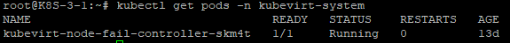

## Failover Controller 설치 가이드

**구성 요소 및 버전**:

* failover-controller([tmaxcloudck/kube-failover-controller:v1.0](https://hub.docker.com/layers/tmaxcloudck/kube-failover-controller/v1.0/images/sha256-537c04aa66e99fff283151a2de6afba1f17810cfef14e4ff21e785da9de93da2?context=repo))

**Prerequisite**:

1. Since the sample-controller uses `apps/v1` deployments, the Kubernetes cluster version should be greater than 1.9.
2. This Controller is tested on K8S 1.16.3 version, Kubevirt 0.26 version environment.
3. import controller docker image before kubectl apply
4. This yaml is used for 'root' user


## 폐쇄망 설치 가이드:

1. 폐쇄망에서 설치하는 경우

  *  작업 디렉토리 생성 및 환경 설정
  ```sh
  $ mkdir -p ~/failover-controller
  $ export FAILOVER_VERSION=v1.0
  $ export DOCKER_REGISTRY=${docker_registry}
  $ export FAILOVER_HOME=~/failover-controller
  $ cd $FAILOVER_HOME
  ```

  * 외부 통신이 가능한 환경에서 필요한 이미지 및 yaml 파일을 다운받고 해당 파일을 Master의 $FAILOVER_HOME으로 이동시킨다.
  ```sh
  $ docker pull tmaxcloudck/kube-failover-controller:$FAILOVER_VERSION
  $ docker save tmaxcloudck/kube-failover-controller:$FAILOVER_VERSION > failover-controller.tar
  $ wget https://raw.githubusercontent.com/tmax-cloud/hypercloud-install-guide/master/VM_KubeVirt/Failover%20Controller/yaml/failover-controller.yaml
  ```

  * failover-controller.tar를 docker-registry에 배포 한다.
  ```sh
  $ docker load -i failover-controller.tar 
  $ docker tag kube-failover-controller:${FAILOVER_VERSION} ${DOCKER_REGISTRY}/kube-failover-controller:${FAILOVER_VERSION}
  $ docker push ${DOCKER_REGISTRY}/kube-failover-controller:${FAILOVER_VERSION}
  $ sed -i "s/kube-failover-controller:$FAILOVER_VERSION/$DOCKER_REGISTRY\/kube-failover-controller:$FAILOVER_VERSION/g" $FAILOVER_HOME/yaml/failover-controller.yaml
  ```
  
## Install Step:

1. [Controller 배포](#step-1)
2. [Controller 확인](#step-2)

# Step 1. Controller 배포:

* k8s cluster 환경에서 failover controller를 배포한다. 

```sh

$ kubectl apply -f failover-controller.yaml
```
# Step 2. Controller 확인:

* k8s cluster의 master node에 controller가 정상적으로 배포되었는지 확인한다.(status Running 확인)

```sh
$ kubectl get pods -n kubevirt-system
```



## Cleanup

You can clean up the created Controller with:

    kubectl delete -f manifests/failover-controller.yaml

## Contact

Tmax A&C, CK3-1 Team
```
Taesun Lee <taesun_lee@tmax.co.kr>, Haemyung Yang <haemyung_yang@tmax.co.kr>, Joowon Cheong <joowon_cheong@tmax.co.kr>
```